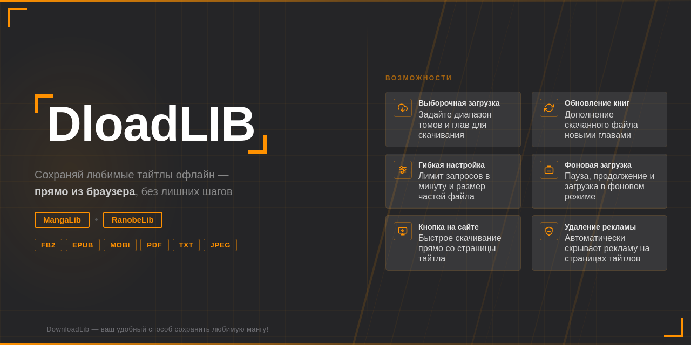
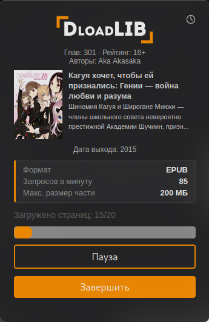
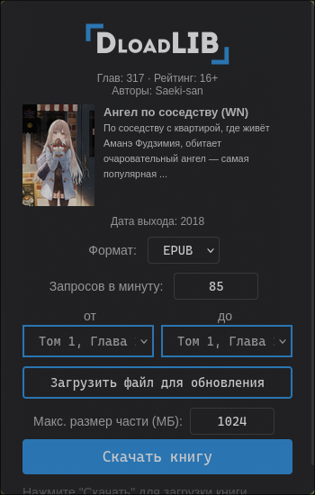
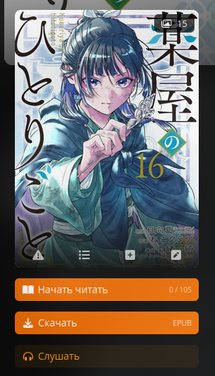

<div align="center">
  
</div>

<div align="center">

# DownloadLib

**Браузерное расширение для загрузки манги и ранобэ с MangaLib и RanobeLib**

[](https://github.com/ivanvit/DownloadLib/actions/workflows/test.yaml)

[](https://github.com/ivanvit100/DownloadLib/actions/workflows/health-check.yaml)


[📦 Скачать](#установка) · [⚠️ Сообщить об ошибке](https://github.com/ivanvit100/DownloadLib/issues) · [✏️ Участвовать в разработке](CONTRIBUTING.md)

</div>

<div align="center">

> Хотите помочь проекту или узнать, что планируется в следующих версиях? Смотрите [CONTRIBUTING.md](CONTRIBUTING.md).

</div>

---

## О проекте

**DownloadLib** — расширение для браузера, позволяющее скачивать мангу с порталов [*MangaLib*](https://mangalib.me/) и [*RanobeLib*](https://ranobelib.me/) в форматах *FB2*, *EPUB*, *MOBI*, *PDF* и *TXT/JPEG*. Поддерживает автоматическую обработку изображений и текста, гибкие настройки скорости загрузки и размеров загружаемых файлов.

---

## Скриншоты

<div align="center">
  <table>
    <tr>
      <td align="center">
        
        <br/>
        <sub><b>MangaLib</b></sub>
      </td>
      <td align="center">
        
        <br/>
        <sub><b>RanobeLib</b></sub>
      </td>
      <td align="center">
        
        <br/>
        <sub><b>Кнопка на сайте</b></sub>
      </td>
    </tr>
  </table>
</div>

---

## Возможности

<table>
  <tr>
    <td>⬇️ <b>Форматы загрузки</b></td>
    <td>FB2, EPUB, MOBI, PDF, TXT, JPEG (ZIP)</td>
  </tr>
  <tr>
    <td>📋 <b>Выборочная загрузка</b></td>
    <td>Загрузка определённых глав и томов произведения</td>
  </tr>
  <tr>
    <td>♻️ <b>Обновление книг</b></td>
    <td>Дополнение скачанного файла недостающими главами</td>
  </tr>
  <tr>
    <td>⏸️ <b>Гибкая настройка</b></td>
    <td>Лимит запросов в минуту и максимальный размер частей файла</td>
  </tr>
  <tr>
    <td>🖼️ <b>Автокадрирование</b></td>
    <td>Разбиение длинных страниц манги на части для читалок</td>
  </tr>
  <tr>
    <td>⚙️ <b>Выбор перевода</b></td>
    <td>Возможность выбрать понравившегося переводчика при имеющихся альтернативных переводах</td>
  </tr>
  <tr>
    <td>🖱️ <b>Кнопка на сайте</b></td>
    <td>Встроенная кнопка быстрого скачивания прямо на странице тайтла</td>
  </tr>
  <tr>
    <td>🛡️ <b>Блокировка рекламы</b></td>
    <td>Автоматически скрывает рекламу на страницах тайтлов</td>
  </tr>
  </tr>
</table>

---

## Поддерживаемые браузеры

| Браузер | Поддержка |
|---|---|
| **Firefox** | Полная поддержка всех функций |
| **Chromium** (Chrome, Edge, Яндекс и др.) | Полная поддержка всех функций |
| **Firefox для Android**| ⚠️ Бета — некоторые функции могут работать нестабильно |

---

## Установка

### Готовые сборки

1. Откройте раздел [**Releases**](https://github.com/ivanvit100/DownloadLib/releases).
2. Для **Firefox** скачайте `.xpi` файл последней версии.
3. Для **Chromium-браузеров** (Chrome, Edge, Яндекс и др.) скачайте `.crx` файл.

### Ручная установка

<details>
<summary><b>Firefox</b></summary>

1. Клонируйте репозиторий:
   ```sh
   git clone https://github.com/ivanvit100/DownloadLib
   ```
2. Откройте страницу `about:debugging` в Firefox.
3. Во вкладке **«Этот Firefox»** выберите **«Загрузить временное дополнение»**.
4. Убедитесь, что выбран файл [`manifest.firefox.json`](manifest.chrome.json) (переименуйте в `manifest.json`).

</details>

<details>
<summary><b>Chromium-браузеры</b></summary>

1. Клонируйте репозиторий:
   ```sh
   git clone https://github.com/ivanvit100/DownloadLib
   ```
2. Откройте страницу `chrome://extensions/` в браузере.
3. Включите **«Режим разработчика»**.
4. Нажмите **«Загрузить распакованное расширение»** и выберите папку проекта.
5. Убедитесь, что выбран файл [`manifest.chrome.json`](manifest.chrome.json) (переименуйте в `manifest.json`).

</details>

---

## Использование

1. Откройте страницу манги на **MangaLib** или **RanobeLib**.
2. Кликните по иконке расширения или нажмите встроенную кнопку на сайте.
3. Выберите нужный формат — FB2, EPUB, MOBI, PDF или TXT/JPEG.
4. При необходимости задайте диапазон глав и лимит запросов.
5. Нажмите **«Скачать книгу»**.

---

## Технические детали

- Для PDF используется **html2pdf**, для EPUB и JPEG — **JSZip**.
- Основная логика загрузки и экспорта — в папке [`core/`](core/).
- Форматтеры — в [`exporters/`](exporters/).
- Поддерживаемые сайты — в [`services/`](services/).
- Для Chrome/Chromium используется [`manifest.chrome.json`](manifest.chrome.json) и сервис-воркер.
- Для Firefox — [`manifest.firefox.json`](manifest.firefox.json) и классический фон.
- Покрытие тестами через **vitest**.

---

## Благодарности

Отдельное спасибо контрибьюторам проекта:

<div align="center">
  <table>
    <tr>
      <td align="center">
        <a href="https://github.com/BlackRavenoo">
          
          <br/><sub><b>BlackRavenoo</b></sub>
        </a>
      </td>
      <td align="center">
        <a href="https://github.com/Dordovel">
          
          <br/><sub><b>Dordovel</b></sub>
        </a>
      </td>
    </tr>
  </table>
</div>

---

## Обратная связь

- [GitHub Issues](https://github.com/ivanvit100/DownloadLib/issues)
- Автор: [ivanvit.ru](https://ivanvit.ru)

---

<div align="center">
  <sub>DownloadLib — ваш удобный способ сохранить любимую мангу!</sub>
</div>
